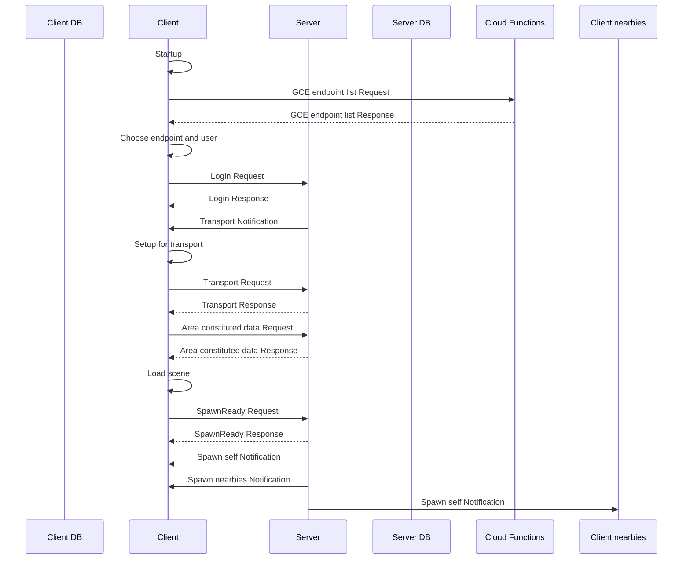

Login

```mermaid
sequenceDiagram
    participant Client DB
    participant Client
    participant Server
    participant Server DB
    participant Cloud Functions
    participant Client nearbies
    Client->>Client: Startup
    Client->>Cloud Functions: GCE endpoint list Request
    Cloud Functions-->>Client: GCE endpoint list Response
    Client->>Client: Choose endpoint and user
    Client->>Server: Login Request
    Server-->>Client: Login Response
    Server->>Client: Transport Notification 
    Client->>Client: Setup for transport
    Client->>Server: Transport Request
    Server-->>Client: Transport Response
    Client->>Server: Area constituted data Request
    Server-->>Client: Area constituted data Response
    Client->>Client: Load scene
    Client->>Server: SpawnReady Request
    Server-->>Client: SpawnReady Response
    Server->>Client: Spawn self Notification
    Server->>Client: Spawn nearbies Notification
    Server->>Client nearbies: Spawn self Notification
```
