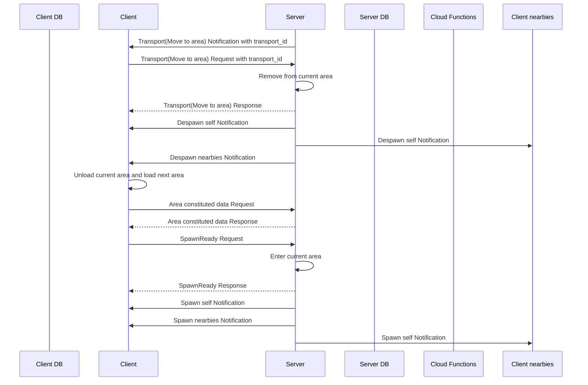

Area to Area

```mermaid
sequenceDiagram
    participant Client DB
    participant Client
    participant Server
    participant Server DB
    participant Cloud Functions
    participant Client nearbies
    Server->>Client: Transport(Move to area) Notification with transport_id
    Client->>Server: Transport(Move to area) Request with transport_id
    Server->>Server: Remove from current area
    Server-->>Client: Transport(Move to area) Response
    Server->>Client: Despawn self Notification
    Server->>Client nearbies: Despawn self Notification
#    Client->>Client: Despawn nearbies locally
    Server->>Client: Despawn nearbies Notification
    Client->>Client: Unload current area and load next area
    Client->>Server: Area constituted data Request
    Server-->>Client: Area constituted data Response
    Client->>Server: SpawnReady Request
    Server->>Server: Enter current area
    Server-->>Client: SpawnReady Response
    Server->>Client: Spawn self Notification
    Server->>Client: Spawn nearbies Notification
    Server->>Client nearbies: Spawn self Notification
```